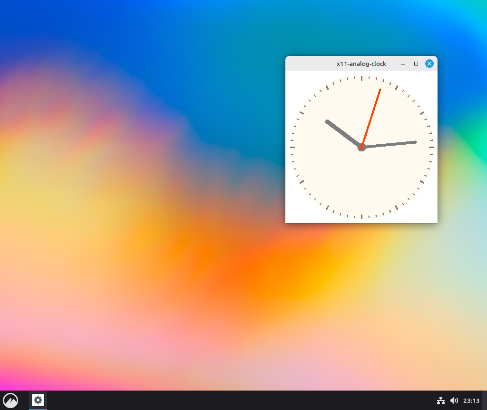
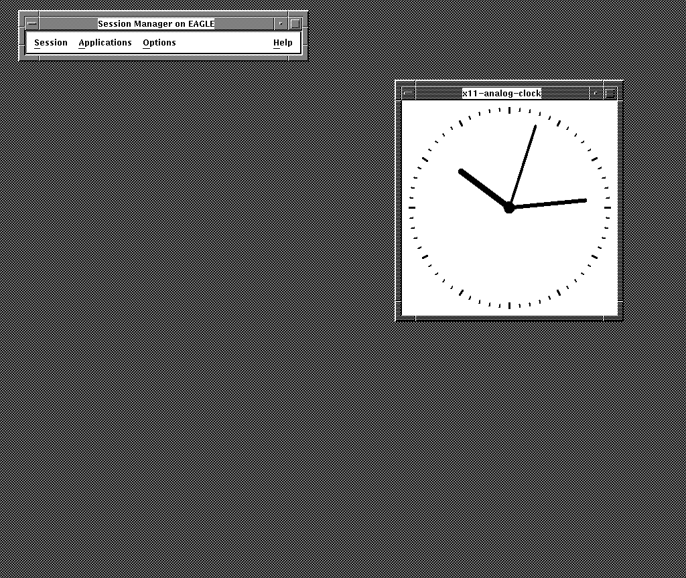

## x11-analog-clock

 &nbsp; &nbsp;

As if the world needs another clock but I felt like it and maybe the result 
looks a bit nicer than some of the others.

The other aim was make the source code as portable as possible so it can be 
compiled and run without modification on as many systems as possible.
